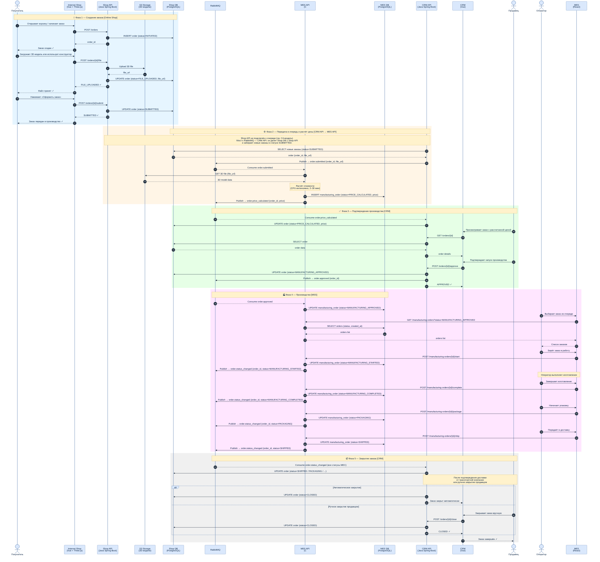

# Жизненный цикл заказа — Sequence Diagram

## Статусы заказа

| # | Статус | Система | Триггер |
|---|--------|---------|---------|
| 1 | `INITIATED` | Online Shop | Покупатель создал корзину |
| 2 | `FILE_UPLOADED` | Online Shop | Загружена/создана 3D-модель |
| 3 | `SUBMITTED` | Online Shop | Покупатель нажал «Оформить заказ» |
| 4 | `PRICE_CALCULATED` | MES | Расчёт стоимости завершён (2–30 мин) |
| 5 | `MANUFACTURING_APPROVED` | CRM | Продавец подтвердил производство |
| 6 | `MANUFACTURING_STARTED` | MES | Оператор взял заказ в работу |
| 7 | `MANUFACTURING_COMPLETED` | MES | Оператор завершил изготовление |
| 8 | `PACKAGING` | MES | Оператор начал упаковку |
| 9 | `SHIPPED` | MES | Заказ передан в доставку |
| 10 | `CLOSED` | CRM | Подтверждение от ТК или ручное закрытие |

## Участники

| Компонент | Технология | Роль |
|-----------|-----------|------|
| Internet Shop | Vue + TypeScript + Three.js | UI покупателя |
| Shop API | Java Spring Boot | Backend магазина |
| CRM | Vue + TypeScript | UI продавца |
| CRM API | Java Spring Boot | Backend CRM |
| MES | React + TypeScript | UI оператора |
| MES API | C# .NET | Расчёт цены, производство |
| RabbitMQ | Message Broker | Асинхронная интеграция между сервисами |
| Shop DB | PostgreSQL | Заказы, покупатели |
| MES DB | PostgreSQL | Производственные заказы, статусы |
| S3 Storage | Object Storage | 3D-модели |
