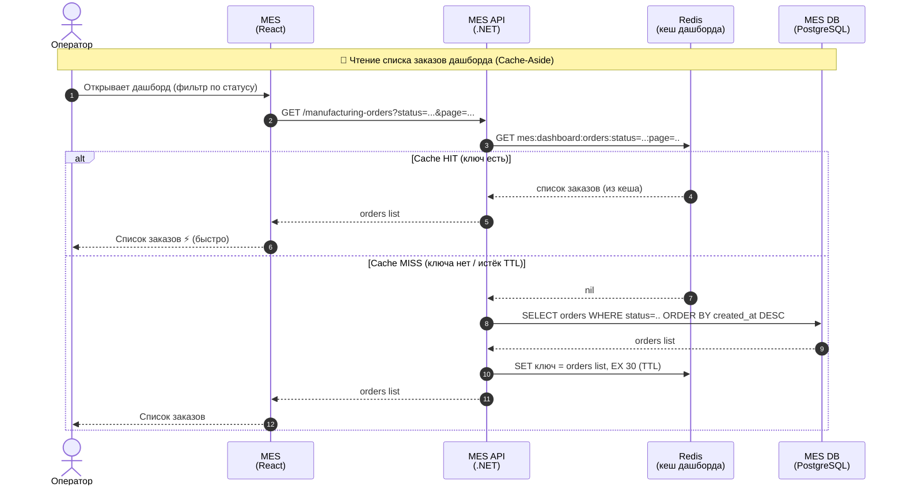
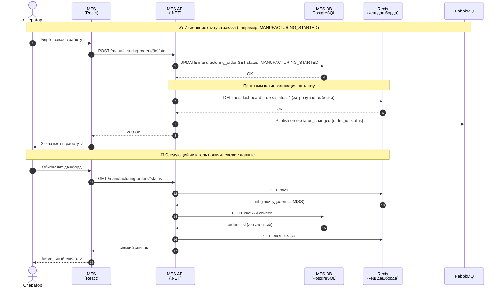

# Архитектурное решение по кешированию

Операторы жалуются на медленную загрузку **первой страницы MES** — дашборда со списком заказов в работе по статусам. Команда уже добавила фильтр по статусам и пагинацию, но это не помогло. При этом операторам критично видеть **самые свежие заказы**: от того, кто первым возьмёт заказ, зависит их вознаграждение. То есть медленный дашборд — это не только UX-проблема, но и прямые потери для людей и бизнеса.

В [Task1](../Task1/Планирование_анализ,%20идентификация%20проблем%20и%20поиск%20решений.md) это зафиксировано как **проблема P5** («Медленная загрузка списка заказов в MES»), и там предложено базовое решение — составной индекс `(status, created_at DESC)` и устранение N+1. Это необходимый, но недостаточный шаг: при линейном росте нагрузки (+100 заказов/мес, открытый партнёрский API) один и тот же тяжёлый `SELECT` выполняется десятками операторов постоянно и бьёт по **единственному инстансу MES DB** (read-replica — только инициатива #7, ещё не развёрнута). Этот документ предлагает следующий архитектурный шаг — **кеширование** горячего чтения дашборда.

---

## 1. Что имеет смысл кешировать

Проанализируем C4-архитектуру и локализуем, где кеш даст максимальный эффект.

| Кандидат | Кешировать? | Почему |
|---|---|---|
| **Список заказов на дашборде MES** (фильтр по статусу, свежие сверху, пагинация) | ✅ **Да — основная цель** | Горячее чтение: читается всеми операторами постоянно. Дорогой агрегирующий запрос к MES DB. Данные одинаковы для всех операторов → один кеш обслуживает многих |
| Карточка отдельного заказа в MES | 🟡 Опционально | Читается реже; при необходимости покрывается тем же паттерном (ключ `order:{id}`) |
| Результат расчёта цены (2–30 мин по числу полигонов) | ❌ Нет (в этом задании) | Уникален для конкретной 3D-модели, повторные запросы редки. Кеширование результата расчёта — отдельная тема, не относится к P5 |
| Данные CRM / Online Shop | ❌ Нет | Проблема P5 локализована в MES; кеш в других сервисах не адресует жалобы операторов |

**Вывод:** кешируем **выборку дашборда MES** — список заказов в работе. Ключ кеша строится по параметрам запроса: `mes:dashboard:orders:status={status}:page={n}:size={m}`.

---

## 2. Мотивация

**Почему предлагаем внедрить кеширование:**

1. **Ускорить дашборд операторов.** Отдавать список из памяти (Redis, доли миллисекунды) вместо тяжёлого запроса к БД — цель субсекундная загрузка страницы.
2. **Разгрузить MES DB.** Повторяющийся одинаковый запрос от множества операторов обслуживается одним кешем, а не N запросами к единственному инстансу БД.
3. **Выдержать рост без немедленного апгрейда БД.** Кеш — буфер на время, пока не развёрнуты read-replica (P7) и горизонтальное масштабирование (P6).

**Какие проблемы решает:**

| Проблема  | Как помогает кеш |
|---|---|
| **P5** — медленный дашборд MES | Прямо: горячее чтение уходит в Redis |
| **P2** — MES API совмещает несовместимые операции (HTTP операторов + расчёт цены) | Косвенно: меньше нагрузки на БД от дашборда → больше ресурсов под расчёт |
| **P7** — единственный инстанс БД на чтение/запись | Косвенно: снижается доля читающей нагрузки до появления реплики |

**Что включаем в кеширование:** список заказов в работе на дашборде MES (по статусам, с пагинацией).

**Метрики, на которые повлияет внедрение:**

| Метрика | Тип | Сейчас | Цель |
|---|---|---|---|
| Время загрузки дашборда, p95 | техническая | секунды | **< 500 мс** |
| QPS тяжёлого `SELECT` к MES DB | техническая | растёт линейно | **↓ в разы** (на величину hit ratio) |
| Cache hit ratio | техническая | — | **> 80%** |
| Доля операторов, видящих актуальный список | бизнес | низкая (задержки) | **≈ 100%** (TTL ≤ 30 с + инвалидация) |

Эффект наблюдаем через метрики кеша в Prometheus из [Task2](../Task2/Выбор%20и%20настройка%20мониторинга%20в%20системе.md): `cache_hits_total`, `cache_misses_total`, `cache_size_bytes`.

---

## 3. Предлагаемое решение

### 3.1. Клиентское или серверное кеширование → **серверное**

Выбираем **серверное** кеширование (Redis между MES API и MES DB).

| Критерий | Клиентское (браузер оператора) | **Серверное (Redis)** ✅ |
|---|---|---|
| Один источник правды | ❌ у каждого оператора своя копия → рассинхрон | ✅ общий кеш для всех |
| Централизованная инвалидация при смене статуса | ❌ невозможна | ✅ удалили ключ — все видят свежее |
| Актуальность (важно для оплаты операторов) | ❌ устаревшие данные у разных людей | ✅ согласованность |
| Разгрузка БД | ❌ не снижает нагрузку на БД от других операторов | ✅ один кеш обслуживает всех |

Данные дашборда общие для всех операторов и часто меняются, а свежесть напрямую влияет на вознаграждение — клиентский кеш здесь создаёт рассинхрон и конфликты «кто первый взял заказ». Серверный Redis даёт один источник правды, переживает рестарт инстанса MES API и готов к горизонтальному масштабированию (P6).

**Технология:** **Redis** — managed-сервис в Yandex Cloud. Поддерживает TTL и pub/sub из коробки, переживает рестарт MES API, масштабируется. (Альтернативы: `IMemoryCache` в процессе .NET — теряется при рестарте и рассинхронизируется при нескольких инстансах; Memcached — без структур данных и pub/sub, слабее для инвалидации.)

### 3.2. Паттерн кеширования → **Cache-Aside**

| Паттерн | Подходит? | Обоснование |
|---|---|---|
| **Cache-Aside** (lazy loading) | ✅ **Да** | Приложение само управляет кешем: на чтении miss → берём из БД → кладём в кеш. Кешируется только то, что реально запрашивают. Устойчив к недоступности Redis — при сбое кеша MES API просто читает из БД (graceful degradation). Идеален для read-heavy дашборда |
| **Write-Through** | ❌ Хуже | Каждая запись синхронно пишется в кеш и в БД. Добавляет latency на запись (смена статуса) и заполняет кеш данными, которые могут не запрашиваться. Список — агрегат многих заказов: «записать насквозь» изменившийся список неудобно (один UPDATE статуса затрагивает много кешированных выборок) |
| **Refresh-Ahead** | 🟡 Частично | Проактивно обновляет ключ до истечения TTL. Хорош для предсказуемого «горячего» ключа, но сложнее и тратит ресурсы на обновление даже без запросов. Рассматриваем как **Решение 2** в доп. задании |

**Выбор: Cache-Aside** — простой, надёжный, устойчивый к сбою Redis и оптимальный для преобладающего чтения.

### 3.3. Sequence-диаграммы

#### Поток 1. Чтение списка заказов (Cache-Aside: hit и miss)

#### Поток 2. Запись об изменении статуса заказа (инвалидация кеша)

**Сущности, участвующие в кешировании:** `Оператор` → `MES (React)` → `MES API (C#)` → `Redis` (кеш) ↔ `MES DB (PostgreSQL)`; при записи также `RabbitMQ` (публикация события смены статуса, как в текущем потоке заказа).

### 3.4. Стратегия инвалидации → **комбинированная: программная (по ключу) + временная (TTL)**

Используем **две стратегии вместе**:

1. **Программная инвалидация по ключу.** При любой смене статуса заказа MES API удаляет затронутые ключи дашборда в Redis (`DEL`). Следующий читатель получает miss и видит свежий список — **мгновенная актуальность**, что критично для оплаты операторов.
2. **Временная инвалидация (TTL) как страховка.** Каждый ключ живёт ограниченное время (например, **10–30 секунд**). Это **fallback на случай сбоя программной инвалидации**: поскольку **P1 (потеря сообщений RabbitMQ) ещё не решён**, а любой баг в коде инвалидации может «залипить» кеш — TTL гарантирует, что кеш самоисцелится максимум за TTL и не будет вечно отдавать устаревшие данные.

#### Сравнение стратегий инвалидации

| | Только временная (TTL) | Только по ключу / программная | **Комбинация (TTL + по ключу)** ✅ |
|---|---|---|---|
| Актуальность данных | ❌ данные устаревают до истечения TTL | ✅ мгновенно при смене статуса | ✅ мгновенно + гарантия свежести |
| Устойчивость к сбою инвалидации | ✅ самоисцеление по TTL | ❌ при потере события кеш «грязный» навсегда | ✅ TTL подстрахует сбой события |
| Нагрузка на БД | средняя (miss каждые TTL) | минимальная (miss только при записи) | низкая (баланс) |
| Сложность | низкая | средняя | средняя |

**Почему не по отдельности:**
- **Только TTL** не годится: операторы будут видеть устаревший список до истечения окна — недопустимо, когда от свежести зависит оплата.
- **Только программная по ключу** опасна: при потере события (P1) или баге кеш останется грязным неопределённо долго.
- **Комбинация** даёт мгновенную актуальность от событий и гарантированное самоисцеление от TTL.

---

## 4. Дополнительное задание: сравнение двух решений

Рассматриваем два жизнеспособных серверных решения на Redis.

| | **Решение 1: Cache-Aside + инвалидация (по ключу + TTL)** | **Решение 2: Refresh-Ahead для горячего ключа дашборда** |
|---|---|---|
| **Описание + диаграмма** | Lazy-загрузка: читаем из Redis, при miss → БД → заполнение. На запись — инвалидация ключа + короткий TTL. Диаграмма — раздел 3.3 | Фоновый воркер MES API проактивно пересчитывает самый горячий ключ (список самых свежих заказов в работе) до истечения TTL, чтобы читатель почти никогда не попадал на холодный miss |
| **Плюсы** | • Простота реализации (1 C#-разработчик) • Устойчивость к сбою Redis (fallback в БД) • Кешируется только реально запрашиваемое • Хорошо ложится на инвалидацию по событиям | • Стабильно низкая latency — нет редких «холодных» miss после инвалидации • Сглаживает пики нагрузки на БД (обновление по расписанию, а не по запросу) • Предсказуемое время отклика |
| **Минусы** | • Редкие «холодные» miss сразу после инвалидации (один запрос идёт в БД) | • Сложнее: нужен фоновый воркер и логика выбора «горячих» ключей • Тратит ресурсы на обновление даже без запросов • Риск обновлять невостребованные выборки (много комбинаций статус+страница) |

### Заключение

Рекомендуем **Решение 1 (Cache-Aside + комбинированная инвалидация)** как основное:
- проще и быстрее внедрить силами команды (один разработчик на C#);
- надёжнее — деградирует мягко при недоступности Redis;
- кеширует только востребованные данные, а множество комбинаций «статус + страница» делает проактивное обновление всех ключей в Refresh-Ahead неэффективным.

**Refresh-Ahead (Решение 2)** оставляем как возможную точечную оптимизацию на будущее — для **одного-двух самых горячих ключей** (например, дефолтный вид дашборда «свежие заказы в работе»), если мониторинг покажет, что холодные miss после инвалидации заметно бьют по latency. Это решение поверх Решения 1, а не вместо него.

---

## 5. Связь с наблюдаемостью

Эффективность кеша отслеживаем сквозь уже внедрённый стек observability:

- **Метрики** ([Task2](../Task2/Выбор%20и%20настройка%20мониторинга%20в%20системе.md)): `cache_hits_total`, `cache_misses_total`, hit ratio, `cache_size_bytes` в Prometheus + дашборд в Grafana; алерт при падении hit ratio < 50%.
- **Трейсинг** ([Task3](../Task3/Архитектурное%20решение%20по%20трейсингу.md)): span с тегом `cache.operation` (get/set/del) и `cache.hit=true/false` в трейсе запроса дашборда.
- **Логи** ([Task4](../Task4/Архитектурное%20решение%20по%20логированию.md)): событие `cache.invalidate` с `cache.key` (хеш, не значение) — для разбора инцидентов с устаревшими данными.

---

## Итог

| Требование Task5 | Раздел |
|---|---|
| Какую часть системы кешировать | 1 |
| Мотивация (зачем, какие проблемы, что включаем) | 2 |
| Клиентское/серверное + обоснование | 3.1 |
| Паттерн (Cache-Aside) + почему не другие | 3.2 |
| Sequence diagram: чтение списка + запись статуса, сущности кеша | 3.3 |
| Стратегия инвалидации + сравнение | 3.4 |
| Доп. задание: 2 решения + таблица + заключение | 4 |
